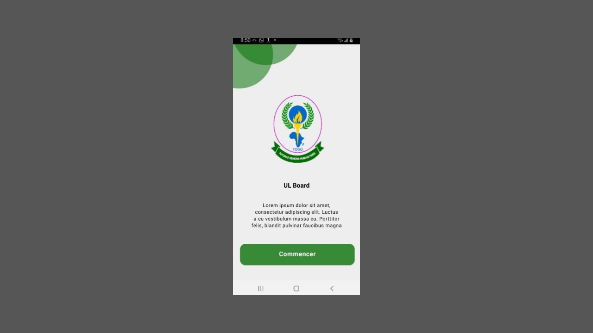
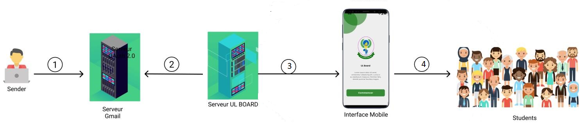

<div align="center" id="top"> 
  

  &#xa0;

  <!-- <a href="https://ulboard_mobile.netlify.app">Demo</a> -->
</div>

<h1 align="center">ULboard Mobile</h1>

<p align="center">
  

  

  

  

  <!--  -->

  <!--  -->

  <!--  -->
</p>

<!-- Status -->

<!-- <h4 align="center"> 
	🚧  Ulboard_mobile 🚀 Under construction...  🚧
</h4> 

<hr> -->

<p align="center">
  <a href="#dart-about">Description</a> &#xa0; | &#xa0; 
  <a href="#sparkles-features">Fonctionnalités</a> &#xa0; | &#xa0;
  <a href="#rocket-technologies">Technologies</a> &#xa0; | &#xa0;
  <a href="#white_check_mark-requirements">Conditions</a> &#xa0; | &#xa0;
  <a href="#checkered_flag-starting">Commencer</a> &#xa0; | &#xa0;
  <a href="#memo-license">Licence</a> &#xa0; | &#xa0;
  <a href="https://github.com/tkmmoise" target="_blank">Auteur</a>
</p>

<br>

## :dart: Description ##

L'application ULBoard mobile a été développé au cours d'un projet scolaire pendant mon cursus scolaire. L'objectif de l'application est de s'assurer de la réception des informations fiables par les étudiants de lomé (TOGO). Elle va permettre d'envoyer des notifications à l’étudiant dès qu’une nouvelle information ou communiqué a été mis en ligne, mais aussi lui permettre de consulter toutes les informations. Elle est une partie composante de tout d'un système illustré ci-dessous. 👇👇

<div align="center"> 
  
  &#xa0;
</div>


<ol>
  <li>Le sender (différentes administrations) envoie un mail valide à l’adress électronique. Ce mail doit contenir un objet et un contenu ou des pièces jointes.
  </li>
  <li>Notre serveur va chercher le mail envoyé</li>
  <li>Notre application mobile reçoit le message de notre serveur et le rend disponible aux utilisateurs</li>
  <li>Notre application mobile notifie les étudiants en fonction des nœuds auxquels ils se sont abonnés.</li>
</ol>

## :sparkles: Fonctionnalités ##

:heavy_check_mark: Recherche par mots-clés;\
:heavy_check_mark: Filtre par (Plus récents, plus anciens);\
:heavy_check_mark: Système d'abonnement;\
:heavy_check_mark: Notification push;\
:heavy_check_mark: Application responsive;

## :rocket: Technologies ##

The following tools were used in this project:

- [React](https://pt-br.reactjs.org/)
- [React Native](https://reactnative.dev/)
- [JavaScript](https://www.javascript.com/)
- [GraphQL](https://graphql.org/)
- [Redux](https://redux.js.org/)

## :white_check_mark: Conditions ##

Avant de démarrer :checkered_flag:, vous devez avoir installé [Git](https://git-scm.com) et [Node](https://nodejs.org/en/). Vous aurez aussi besoin d'un appareil Android physique ou d'un appareil Android virtuel pour exécuter l'application.

## :checkered_flag: Commencer ##

```bash
# Cloner ce projet
$ git clone https://github.com/tkmmoise/ULMobile

# Accéder
$ cd ULMobile

# Installer les dépendances
$ npm install

# Exécuter le projet
$ npx react-native start
$ npx react-native run-android

# Le serveur a été déployé sur <https://ulboard-back.herokuapp.com/>
```

## :memo: Licence ##

Ce projet est sous licence du MIT. Pour plus de détails, consultez le fichier [LICENSE](LICENSE.md).


Coder avec :heart: par <a href="https://github.com/tkmmoise" target="_blank">Moses</a> et <a href="https://github.com/ktiass" target="_blank">Kevin</a>

&#xa0;

<a href="#top">Haut de la page</a>
